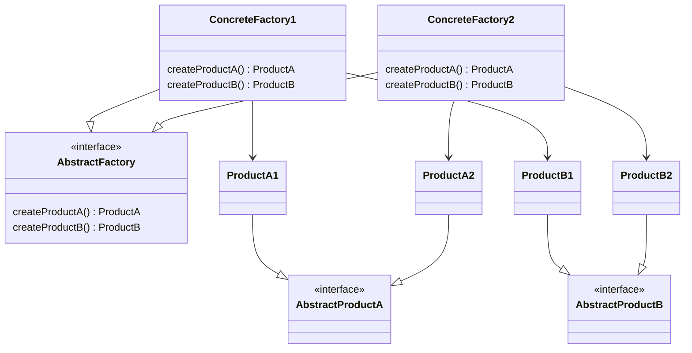
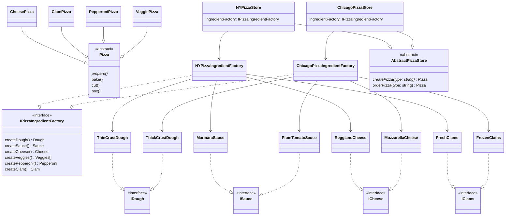

# Abstract Factory

```mermaid
classDiagram
class AbstractFactory{
    <<interface>>
    createProductA() ProductA
    createProductB() ProductB
}
class ConcreteFactory1{
    createProductA() ProductA
    createProductB() ProductB
}
class ConcreteFactory2{
    createProductA() ProductA
    createProductB() ProductB
}
ConcreteFactory1 --|> AbstractFactory
ConcreteFactory2 --|> AbstractFactory
class AbstractProductA{
    <<interface>>
}
class ProductA1
class ProductA2
ProductA1 --|> AbstractProductA
ProductA2 --|> AbstractProductA
class AbstractProductB{
    <<interface>>
}
class ProductB1
class ProductB2
ProductB1 --|> AbstractProductB
ProductB2 --|> AbstractProductB
ConcreteFactory1 --> ProductA1
ConcreteFactory1 --> ProductB1
ConcreteFactory2 --> ProductA2
ConcreteFactory2 --> ProductB2
```
# PizzaStore

```mermaid
classDiagram
class Pizza{
    <<abstract>>
    prepare()*
    bake()
    cut()
    box()
}

class CheesePizza
class ClamPizza
class PepperoniPizza
class VeggiePizza
CheesePizza --|> Pizza
ClamPizza --|> Pizza
PepperoniPizza --|> Pizza
VeggiePizza --|> Pizza

class IPizzaIngredientFactory{
    <<interface>>
    createDough() Dough
    createSauce() Sauce
    createCheese() Cheese
    createVeggies() Veggies[]
    createPepperoni() Pepperoni
    createClam() Clam
}
class NYPizzaIngredientFactory
class ChicagoPizzaIngredientFactory
NYPizzaIngredientFactory ..|> IPizzaIngredientFactory
ChicagoPizzaIngredientFactory ..|> IPizzaIngredientFactory
class IDough{
    <<interface>>
}
class ThinCrustDough
class ThickCrustDough
ThinCrustDough ..|> IDough
ThickCrustDough ..|> IDough
class ISauce{
    <<interface>>
}
class MarinaraSauce
class PlumTomatoSauce
MarinaraSauce ..|> ISauce
PlumTomatoSauce ..|> ISauce
class ICheese{
    <<interface>>
}
class ReggianoCheese
class MozzarellaCheese
ReggianoCheese ..|> ICheese
MozzarellaCheese ..|> ICheese
class IClams{
    <<interface>>
}
class FreshClams
class FrozenClams
FreshClams ..|> IClams
FrozenClams ..|> IClams
NYPizzaIngredientFactory --> ThinCrustDough
NYPizzaIngredientFactory --> MarinaraSauce
NYPizzaIngredientFactory --> ReggianoCheese
NYPizzaIngredientFactory --> FreshClams
ChicagoPizzaIngredientFactory --> ThickCrustDough
ChicagoPizzaIngredientFactory --> PlumTomatoSauce
ChicagoPizzaIngredientFactory --> MozzarellaCheese
ChicagoPizzaIngredientFactory --> FrozenClams

class AbstractPizzaStore{
    <<abstract>>
    createPizza(type: string) Pizza*
    orderPizza(type: string) Pizza
}
class NYPizzaStore{
    ingredientFactory: IPizzaIngredientFactory
}
class ChicagoPizzaStore{
    ingredientFactory: IPizzaIngredientFactory
}
NYPizzaStore --|> AbstractPizzaStore
ChicagoPizzaStore --|> AbstractPizzaStore
NYPizzaStore --> NYPizzaIngredientFactory
ChicagoPizzaStore --> ChicagoPizzaIngredientFactory

```