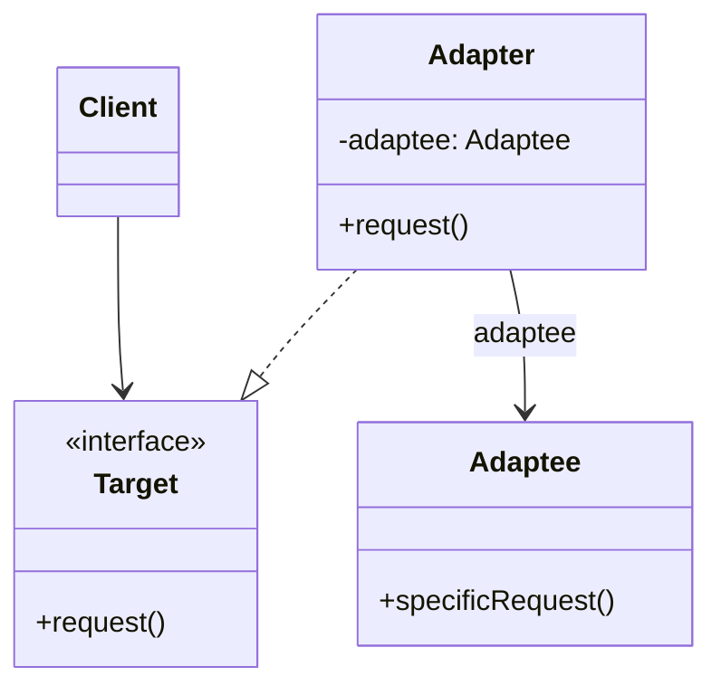
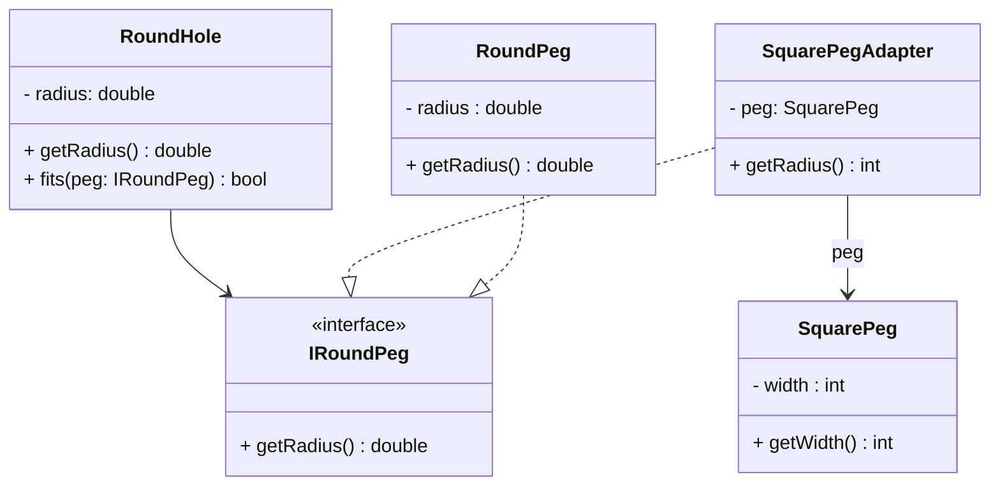

# Adapter Pattern

```mermaid
classDiagram
    class Client
    class Target{
        <<interface>>
        +request()
    }
    class Adapter{
        -adaptee: Adaptee
        +request()
    }
    class Adaptee{
        +specificRequest()
    }
    Client --> Target
    Adapter ..|> Target
    Adapter --> Adaptee : adaptee
```
# Pegs

```mermaid
classDiagram
class IRoundPeg{
    <<interface>>
    + getRadius() double
}
class RoundPeg{
    - radius : double
    + getRadius() double
}
class RoundHole{
    - radius: double
    + getRadius()double
    + fits(peg: IRoundPeg) bool
}
RoundHole --> IRoundPeg
class SquarePeg{
    - width : int
    + getWidth() int
}
class SquarePegAdapter{
    - peg: SquarePeg
    + getRadius() int
}
SquarePegAdapter --> SquarePeg : peg    
SquarePegAdapter ..|> IRoundPeg
RoundPeg ..|> IRoundPeg
```