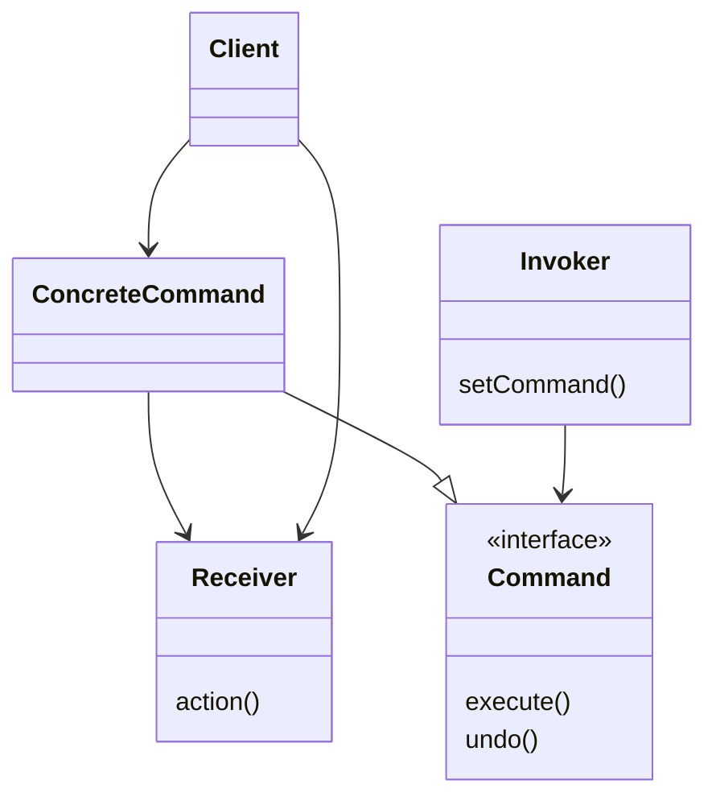
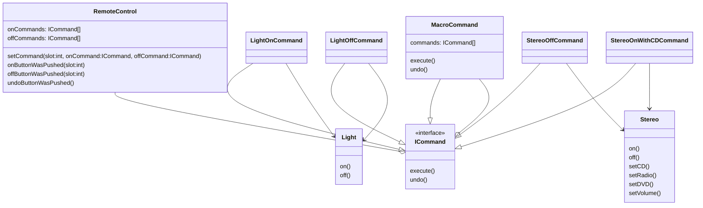

# Command Pattern

```mermaid
classDiagram
class Command{
    <<interface>>
    execute()
    undo()
}
class ConcreteCommand
ConcreteCommand --|> Command
class Receiver{
    action()
}
class Invoker{
    setCommand()
}
Invoker --> Command
ConcreteCommand --> Receiver
class Client
Client --> Receiver
Client --> ConcreteCommand
```
# Remote Controller

```mermaid
classDiagram
class ICommand{
    <<interface>>
    execute()
    undo()
}
class LightOnCommand
class LightOffCommand
LightOnCommand --|> ICommand
LightOffCommand --|> ICommand
class Light{
    on()
    off()
}
LightOnCommand --> Light
LightOffCommand --> Light
class RemoteControl{
    onCommands: ICommand[]
    offCommands: ICommand[]
    setCommand(slot:int, onCommand:ICommand, offCommand:ICommand)
    onButtonWasPushed(slot:int)
    offButtonWasPushed(slot:int)
    undoButtonWasPushed()
}
RemoteControl --o ICommand
class Stereo{
    on()
    off()
    setCD()
    setRadio()
    setDVD()
    setVolume()
}
class StereoOffCommand
class StereoOnWithCDCommand
StereoOffCommand --|> ICommand
StereoOnWithCDCommand --|> ICommand
StereoOffCommand --> Stereo
StereoOnWithCDCommand --> Stereo
class MacroCommand {
    commands: ICommand[]
    execute()
    undo()
}
MacroCommand --|> ICommand
MacroCommand --o ICommand
```