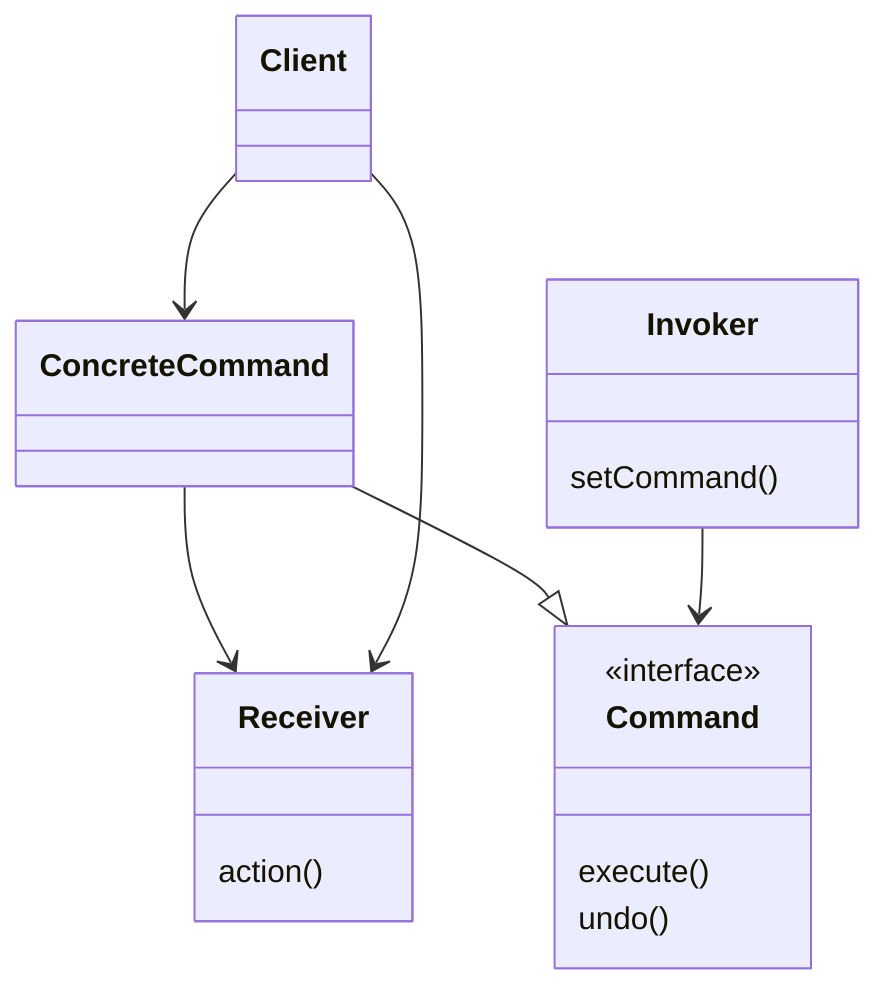
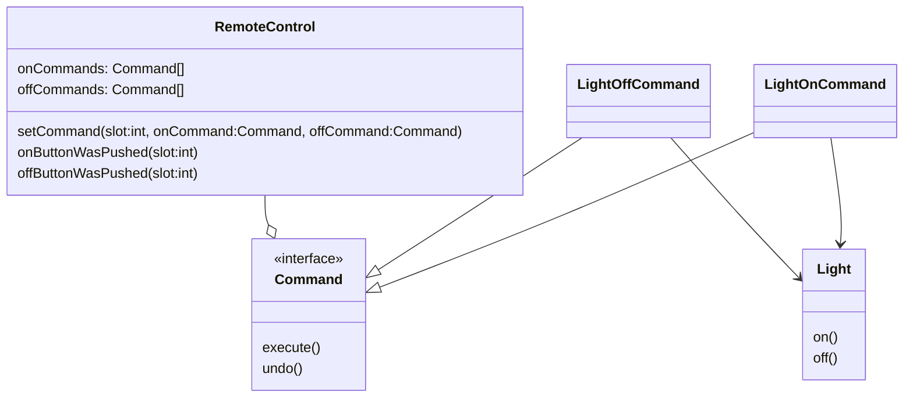

# Command Pattern

```mermaid
classDiagram
class Command{
    <<interface>>
    execute()
    undo()
}
class ConcreteCommand
ConcreteCommand --|> Command
class Receiver{
    action()
}
class Invoker{
    setCommand()
}
Invoker --> Command
ConcreteCommand --> Receiver
class Client
Client --> Receiver
Client --> ConcreteCommand
```
# Remote Controller

```mermaid
classDiagram
class Command{
    <<interface>>
    execute()
    undo()
}
class LightOnCommand
class LightOffCommand
LightOnCommand --|> Command
LightOffCommand --|> Command
class Light{
    on()
    off()
}
LightOnCommand --> Light
LightOffCommand --> Light
class RemoteControl{
    onCommands: Command[]
    offCommands: Command[]
    setCommand(slot:int, onCommand:Command, offCommand:Command)
    onButtonWasPushed(slot:int)
    offButtonWasPushed(slot:int)
}
RemoteControl --o Command
```