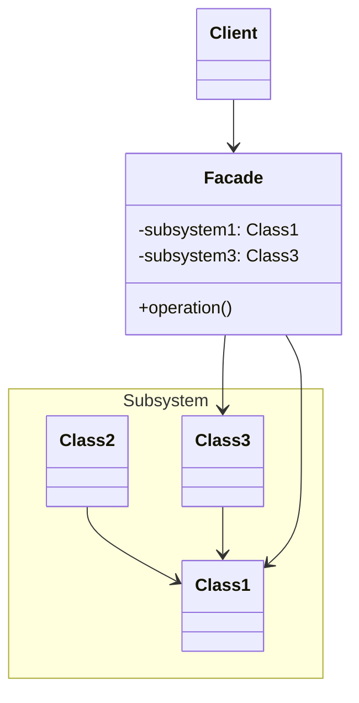
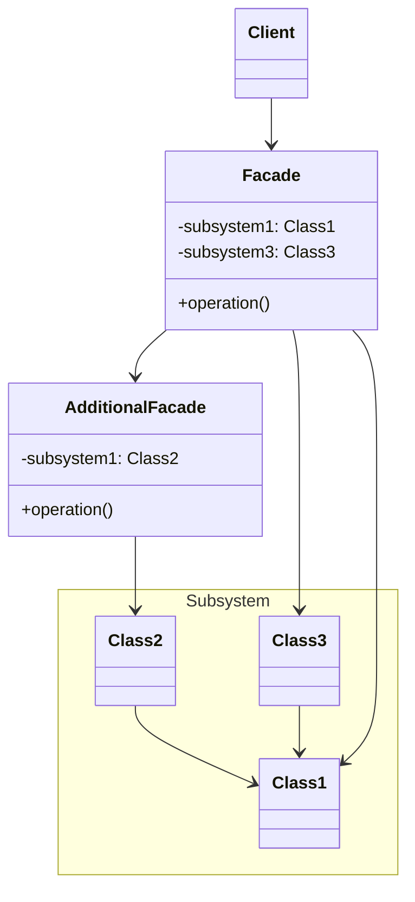

# Facade Pattern

```mermaid
classDiagram
    class Facade {
        -subsystem1: Class1
        -subsystem3: Class3
        +operation()
    }
    class Client
    Client --> Facade
    namespace Subsystem {
        class Class1
        class Class2
        class Class3
    }
    Class2 --> Class1
    Class3 --> Class1
    Facade --> Class1
    Facade --> Class3
```
## Facade Pattern with Additional Facade

```mermaid
classDiagram
    class Facade {
        -subsystem1: Class1
        -subsystem3: Class3
        +operation()
    }
    class Client
    Client --> Facade
    namespace Subsystem {
        class Class1
        class Class2
        class Class3
    }
    Class2 --> Class1
    Class3 --> Class1
    Facade --> Class1
    Facade --> Class3
    class AdditionalFacade {
        -subsystem1: Class2
        +operation()
    }
    Facade --> AdditionalFacade
    AdditionalFacade --> Class2

```