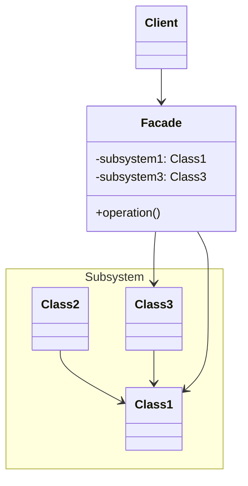
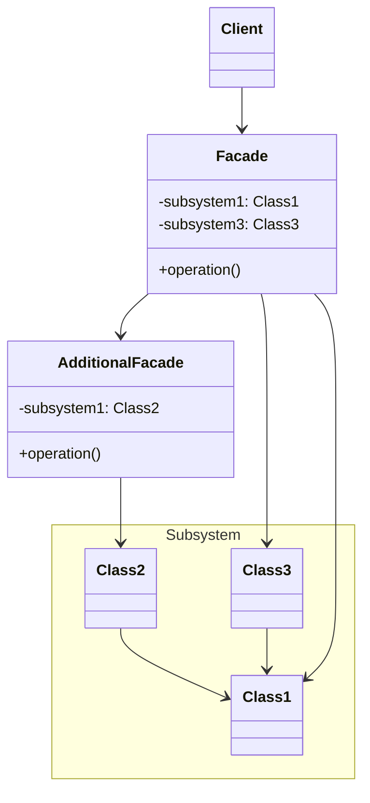
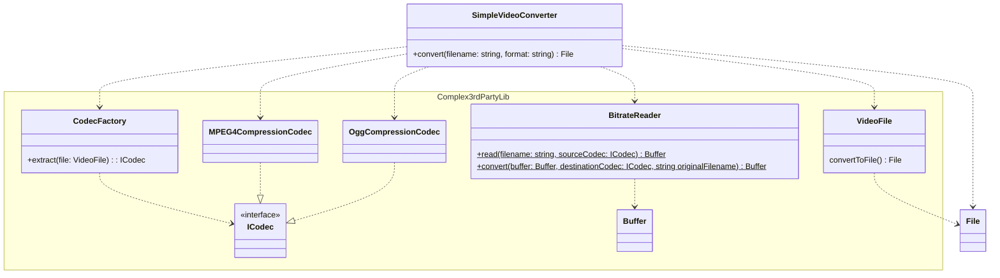

# Facade Pattern

```mermaid
classDiagram
    class Facade {
        -subsystem1: Class1
        -subsystem3: Class3
        +operation()
    }
    class Client
    Client --> Facade
    namespace Subsystem {
        class Class1
        class Class2
        class Class3
    }
    Class2 --> Class1
    Class3 --> Class1
    Facade --> Class1
    Facade --> Class3
```
## Facade Pattern with Additional Facade

```mermaid
classDiagram
    class Facade {
        -subsystem1: Class1
        -subsystem3: Class3
        +operation()
    }
    class Client
    Client --> Facade
    namespace Subsystem {
        class Class1
        class Class2
        class Class3
    }
    Class2 --> Class1
    Class3 --> Class1
    Facade --> Class1
    Facade --> Class3
    class AdditionalFacade {
        -subsystem1: Class2
        +operation()
    }
    Facade --> AdditionalFacade
    AdditionalFacade --> Class2

```
# Video Converter

```mermaid
classDiagram
    namespace Complex3rdPartyLib {
        class VideoFile{
            convertToFile() File
        }
        class CodecFactory
        class MPEG4CompressionCodec
        class OggCompressionCodec
        class CodecFactory{
            +extract(file: VideoFile): ICodec
        }
        class BitrateReader
        class ICodec{
            <<interface>>
        }
        class Buffer
        class BitrateReader{
            +read(filename: string, sourceCodec: ICodec) Buffer$
            +convert(buffer: Buffer, destinationCodec: ICodec, string originalFilename) Buffer$
        }
    }
    VideoFile ..> File
    SimpleVideoConverter ..> File
    BitrateReader ..> Buffer
    CodecFactory ..> ICodec
    MPEG4CompressionCodec ..|> ICodec
    OggCompressionCodec ..|> ICodec
    class SimpleVideoConverter {
        +convert(filename: string, format: string) File
    }
    SimpleVideoConverter ..> VideoFile
    SimpleVideoConverter ..> CodecFactory
    SimpleVideoConverter ..> MPEG4CompressionCodec
    SimpleVideoConverter ..> OggCompressionCodec
    SimpleVideoConverter ..> BitrateReader
    class File{

    }
```