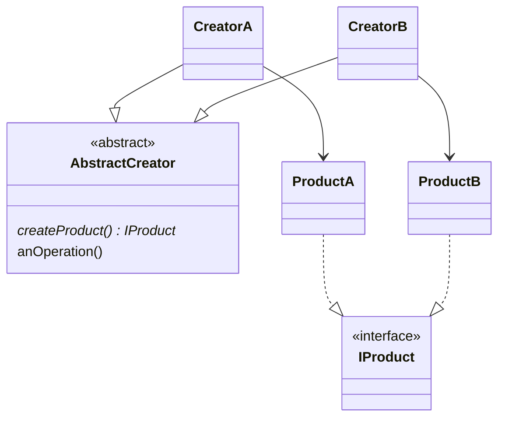
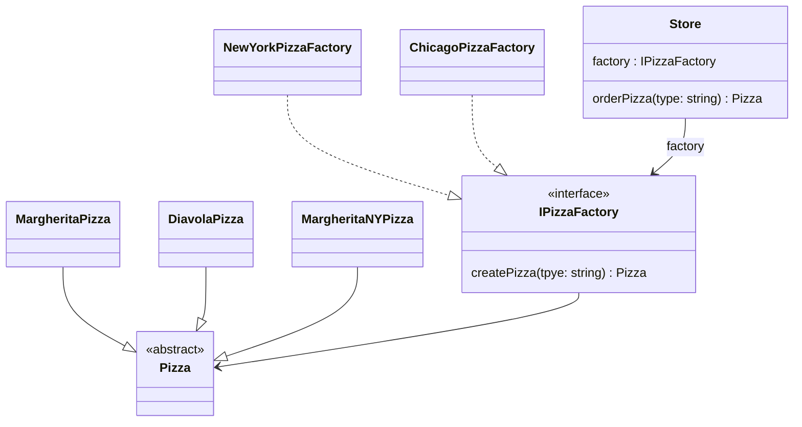

# Factory Method

```mermaid
classDiagram
    class IProduct{
        <<interface>>
    }

    class AbstractCreator{
        <<abstract>>
        createProduct() IProduct*
        anOperation()
    }

    class ProductA{

    }
    ProductA ..|> IProduct
    class ProductB{

    }
    ProductB ..|> IProduct

    class CreatorA{

    }
    CreatorA --|> AbstractCreator
    CreatorA --> ProductA

    class CreatorB{

    }
    CreatorB --|> AbstractCreator
    CreatorB --> ProductB
```

# PizzaStore

```mermaid
classDiagram
    class Pizza{
        <<abstract>>
    }
    class MargheritaPizza
    class DiavolaPizza
    class MargheritaNYPizza
    MargheritaPizza --|> Pizza
    DiavolaPizza --|> Pizza
    MargheritaNYPizza --|> Pizza

    class IPizzaFactory{
        <<interface>>
        createPizza(tpye: string) Pizza 
    }
    IPizzaFactory --> Pizza
    class NewYorkPizzaFactory
    class ChicagoPizzaFactory
    NewYorkPizzaFactory ..|> IPizzaFactory
    ChicagoPizzaFactory ..|> IPizzaFactory

    class Store{
        factory : IPizzaFactory
        orderPizza(type: string) Pizza
    }
    Store --> IPizzaFactory : factory
```
