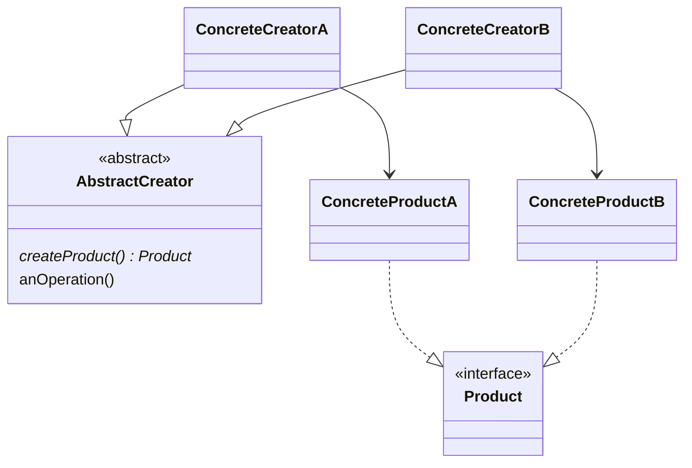
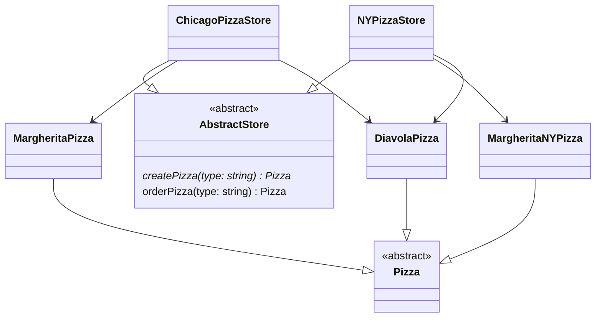

# Factory Method

```mermaid
classDiagram
    class Product{
        <<interface>>
    }

    class AbstractCreator{
        <<abstract>>
        createProduct() Product*
        anOperation()
    }

    class ConcreteProductA{

    }
    ConcreteProductA ..|> Product
    class ConcreteProductB{

    }
    ConcreteProductB ..|> Product

    class ConcreteCreatorA{

    }
    ConcreteCreatorA --|> AbstractCreator
    ConcreteCreatorA --> ConcreteProductA

    class ConcreteCreatorB{

    }
    ConcreteCreatorB --|> AbstractCreator
    ConcreteCreatorB --> ConcreteProductB
```

# PizzaStore

```mermaid
classDiagram
    class Pizza{
        <<abstract>>
    }
    class MargheritaPizza
    class DiavolaPizza
    class MargheritaNYPizza
    MargheritaPizza --|> Pizza
    DiavolaPizza --|> Pizza
    MargheritaNYPizza --|> Pizza

    class AbstractStore{
        <<abstract>>
        createPizza(type: string) Pizza*
        orderPizza(type: string) Pizza
    }
    class NYPizzaStore
    class ChicagoPizzaStore
    NYPizzaStore --|> AbstractStore
    ChicagoPizzaStore --|> AbstractStore

    NYPizzaStore --> MargheritaNYPizza
    NYPizzaStore --> DiavolaPizza
    ChicagoPizzaStore --> MargheritaPizza
    ChicagoPizzaStore --> DiavolaPizza


```
