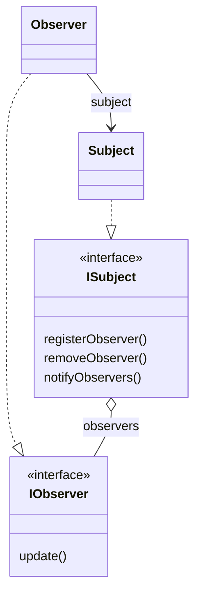

```mermaid
classDiagram
class ISubject {
  <<interface>>
  registerObserver()
  removeObserver()
  notifyObservers()
}

class Subject

Subject ..|> ISubject

class IObserver {
  <<interface>>
  update()
}

class Observer

Observer ..|> IObserver

ISubject o-- IObserver : observers

Observer --> Subject : subject

```