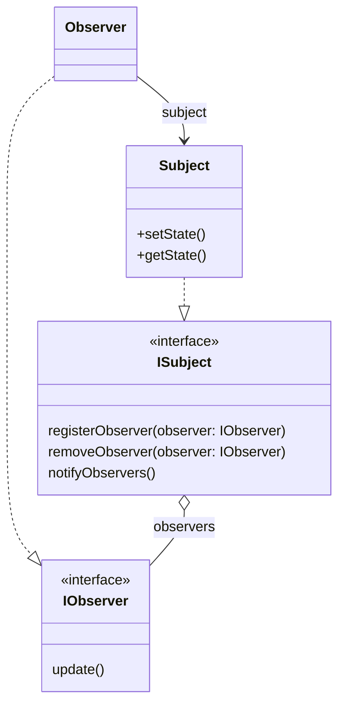
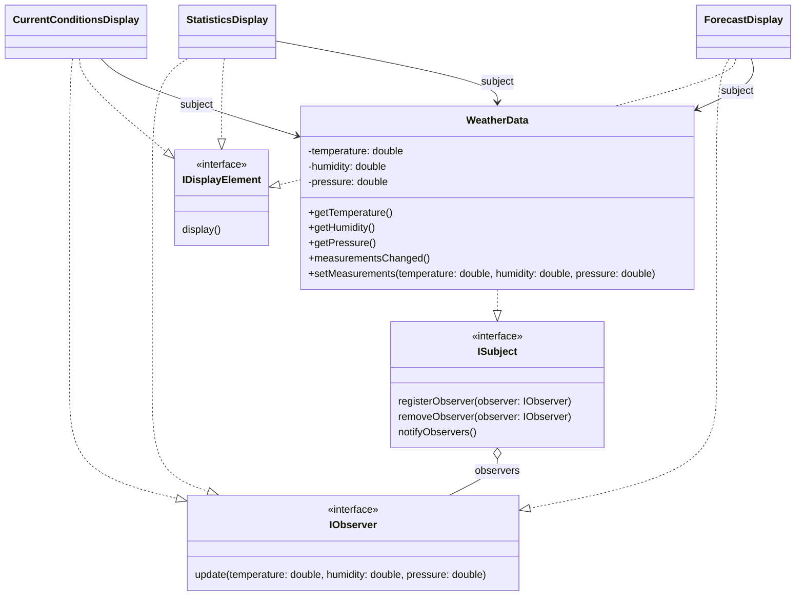
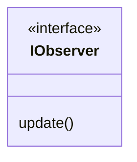

# Observer Pattern

```mermaid
classDiagram
class ISubject {
  <<interface>>
  registerObserver(observer: IObserver )
  removeObserver(observer: IObserver )
  notifyObservers()
}

class Subject{
    +setState()
    +getState()
}

Subject ..|> ISubject

class IObserver {
  <<interface>>
  update()
}

class Observer

Observer ..|> IObserver

ISubject o-- IObserver : observers

Observer --> Subject : subject

```
# Weather

```mermaid
classDiagram
class ISubject {
  <<interface>>
  registerObserver(observer: IObserver )
  removeObserver(observer: IObserver )
  notifyObservers()
}

class IObserver {
  <<interface>>
  update(temperature: double, humidity: double, pressure: double)
}

ISubject o-- IObserver : observers

class WeatherData{
  -temperature: double
  -humidity: double
  -pressure: double
  +getTemperature()
  +getHumidity()
  +getPressure()
  +measurementsChanged()
  +setMeasurements(temperature: double, humidity: double, pressure: double)
}

WeatherData ..|> ISubject

class IDisplayElement {
  <<interface>>
  display()
}

class CurrentConditionsDisplay
class StatisticsDisplay
class ForecastDisplay
CurrentConditionsDisplay ..|> IObserver
StatisticsDisplay ..|> IObserver
ForecastDisplay ..|> IObserver
CurrentConditionsDisplay ..|> IDisplayElement
StatisticsDisplay ..|> IDisplayElement
ForecastDisplay ..|> IDisplayElement

CurrentConditionsDisplay --> WeatherData : subject
StatisticsDisplay --> WeatherData : subject
ForecastDisplay --> WeatherData : subject
```
# WeatherPull

```mermaid
classDiagram

class IObserver {
  <<interface>>
  update()
}
```