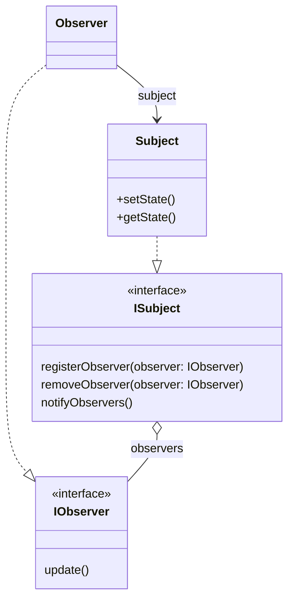

```mermaid
classDiagram
class ISubject {
  <<interface>>
  registerObserver(observer: IObserver )
  removeObserver(observer: IObserver )
  notifyObservers()
}

class Subject{
    +setState()
    +getState()
}

Subject ..|> ISubject

class IObserver {
  <<interface>>
  update()
}

class Observer

Observer ..|> IObserver

ISubject o-- IObserver : observers

Observer --> Subject : subject

```