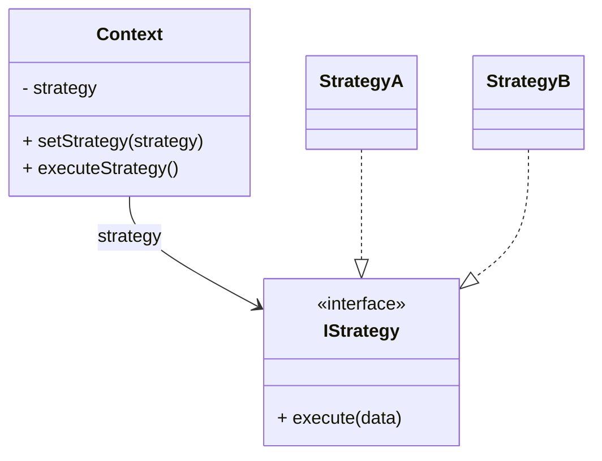

# Strategy

```mermaid
classDiagram

class Context{
    - strategy
    + setStrategy(strategy)
    + executeStrategy()
}

class IStrategy {
    <<interface>>
    + execute(data)
}

Context --> IStrategy : strategy

class StrategyA
class StrategyB
StrategyA ..|> IStrategy
StrategyB ..|> IStrategy
```