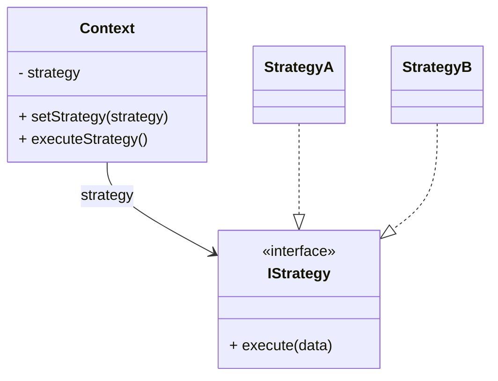
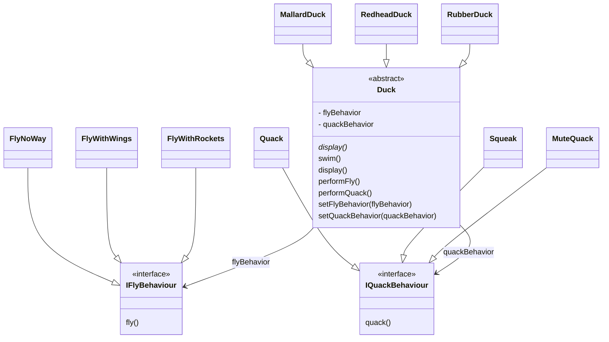

# Strategy

```mermaid
classDiagram

class Context{
    - strategy
    + setStrategy(strategy)
    + executeStrategy()
}

class IStrategy {
    <<interface>>
    + execute(data)
}

Context --> IStrategy : strategy

class StrategyA
class StrategyB
StrategyA ..|> IStrategy
StrategyB ..|> IStrategy
```
# SimUDuck

```mermaid
classDiagram
class Duck{
    <<abstract>>
    - flyBehavior
    - quackBehavior
    display()*
    swim()
    display()
    performFly()
    performQuack()
    setFlyBehavior(flyBehavior)
    setQuackBehavior(quackBehavior)
}

class MallardDuck
class RedheadDuck
class RubberDuck
MallardDuck --|> Duck
RedheadDuck --|> Duck
RubberDuck --|> Duck

class IFlyBehaviour{
    <<interface>>
    fly()
}
class FlyWithWings
class FlyNoWay
class FlyWithRockets
FlyNoWay --|> IFlyBehaviour
FlyWithWings --|> IFlyBehaviour
FlyWithRockets --|> IFlyBehaviour

Duck --> IFlyBehaviour : flyBehavior

class IQuackBehaviour{
    <<interface>>
    quack()
}
class Quack
class Squeak
class MuteQuack
Quack --|> IQuackBehaviour
Squeak --|> IQuackBehaviour
MuteQuack --|> IQuackBehaviour

Duck --> IQuackBehaviour : quackBehavior
```